# Instructions

- Please redraw images to improve them 
- For cloud service icons - Use icons from https://diagrams.mingrammer.com/
	- https://colab.research.google.com/drive/1Hzu2q5oBRcwESAMr7W7ALhm8u8HjhV4D#scrollTo=gA2Ha8-Y53LS
- Important Resource - https://github.com/in28minutes/learning-paths-cloud-and-devops/blob/main/aws-vs-azure-vs-gcp.md
- Playlist - https://www.youtube.com/watch?v=nBwDFt1LHCg&list=PLBBog2r6uMCQgjZrb1auB1VdMrS-YqYzz&index=11
- AWS for Beginners - https://youtu.be/rq8qvAs27rg
- Azure for Beginners - https://www.youtube.com/watch?v=kg4tV1HOfns
- Google Cloud for Beginners - https://www.youtube.com/watch?v=OwF9-K5JFb8
- My Recording Notes - https://github.com/in28minutes/learning-paths-cloud-and-devops/blob/main/00-cloud-made-easy/notes.md

# Add all notes into this

<details>
    <summary>Notes</summary>
    <ul>
        <li>HTML LIST <b>1</b></li>
        <li>HTML LIST <b>2</b></li>
        <li>HTML LIST <b>3</b></li>
    </ul>
</details>

# Cloud service categories

## Overview

- Do you want to continue running applications in the cloud, the same way you run them in your data center?
- OR are there OTHER approaches?
- You should understand some terminology:
	- IaaS (Infrastructure as a Service) 
	- PaaS (Platform as a Service) 
	- ....
- Let's get on a quick journey to understand these!

## IAAS (Infrastructure as a Service) 

`Diagram: Applications > Application Runtime > OS > Virtualization > Physical Hardware > Networking` (First 3 are customer responsibility)

- Use only infrastructure from cloud provider
	- Ex: Using VM service to deploy your apps/databases
- Cloud provider is responsible for:
	- Hardware, Networking & Virtualization
- You are responsible for:
	- OS upgrades and patches
	- Application Code and Runtime
	- Configuring load balancing
	- Auto scaling
	- Availability
	- etc.. ( and a lot of things!)

## PAAS (Platform as a Service) 

`Diagram: Applications > Application Runtime > OS > Virtualization > Physical Hardware > Networking` (First 1 is customer responsibility)

- Use a platform provided by the cloud
	- Cloud provider is responsible for:
		- Hardware, Networking & Virtualization
		- OS (incl. upgrades and patches)
		- Application Runtime
		- Auto scaling, Availability & Load balancing etc..
	- You are responsible for:
		- Configuration (of Application and Services)
		- Application code (if needed)
- Examples:
	- Compute: AWS Elastic Beanstalk, Azure App Service, Google App Engine
	- Databases: Relational & NoSQL (Amazon RDS, Google Cloud SQL, Azure SQL Database etc)
	- Queues, AI, ML, Operations etc!

## SaaS (Software as a Service) 

- Centrally hosted software (mostly on the cloud)
	- Offered on a subscription basis (pay-as-you-go)
	- Examples: 
		- Email, calendaring & office tools (such as Outlook 365, Microsoft Office 365, Gmail, Google Docs)
		- Customer relationship management (CRM), enterprise resource planning (ERP) and document management tools
- Cloud provider is responsible for:
	- OS (incl. upgrades and patches)
	- Application Runtime
	- Auto scaling, Availability & Load balancing etc..
	- Application code and/or
	- Application Configuration (How much memory? How many instances? ..)
- Customer is responsible for:
	- Configuring the software!

## Example: VMs with Load Balancer

From Video: https://www.youtube.com/watch?v=cUo1TLdAW48&list=PLBBog2r6uMCQgjZrb1auB1VdMrS-YqYzz&index=2

https://raw.githubusercontent.com/in28minutes/learning-paths-cloud-and-devops/main/00-cloud-made-easy/2%20-%20Managed%20Services.svg

# Docker - Update Existing Article

Video - https://www.youtube.com/watch?v=6FqrZ6qq2Q4&list=PLBBog2r6uMCQgjZrb1auB1VdMrS-YqYzz&index=3

`Dev > QA > Stage > Production`

Releasing software to production is difficult. Some applications have tri-monthly or bi-monthly releases. How can you have faster release cycles?

## Microservices

`Diagram: Microservice 1 > Microservice 2 > Microservice 3 > Microservice 4 > Microservice 5` (Each microservice calling another. Also show that each microservice has its own database. Show that different microservices are built with different languages. Also show that each microservice can have different number of instances active at a specific point in time.)

- Enterprises are heading towards microservices architectures
- Approach: Build small focused microservices instead of large applications
- Why?
	- Innovation because of Faster Release Cycles
	- Flexibility to build applications in different programming languages (Go, Java, Python, JavaScript,  etc)
	- Flexibility in scaling
- Cost of Flexibility:
	- Microservices need complex features AND
	- Deployments become complex!
	- How can we have one way of deploying Go, Java, Python or JavaScript .. microservices?
		- Enter containers!

## How does Traditional Deployment work?

(REUSE IMAGE CREATED EARLIER)

- Deployment process described in a document
- Operations team follows steps to:
	- Setup Hardware
	- Setup OS (Linux, Windows, Mac, ...)
	- Install Software (Java, Python, NodeJs, ...)
	- Setup Application Dependencies
	- Install Application
- Manual approach:
	- Takes a lot of time
	- High chance of making mistakes

## Understanding Deployment Process with Docker

- Simplified Deployment Process:
	- OS doesn't matter
	- Programming Language does not matter
	- Hardware does not matter
- 01: Developer creates a Docker Image
- 02: Operations run the Docker Image 
	- Using a very simple command
- Takeaway: Once you have a Docker Image, irrespective of what the docker image contains, you run it the same way!
	- Make your operations team happy

## How does Docker Make it Easy?

- Docker image has everything you need to run your application:
	- **Base Operating System**: The core OS layer, such as a minimal Ubuntu or Alpine Linux distribution
	- **Application Runtime**: This includes environments like the Java Development Kit (JDK), Python interpreter, Node.js runtime, etc., depending on the application's needs.
	- **Application Code**: The actual code (or binary) of the application you want to run in the container.
	- **Application Dependencies**: Libraries and other dependencies required by the application, often managed by package managers like npm for Node.js, pip for Python, or Maven/Gradle for Java.
	- **Configuration Files**: Files required to configure the application and its environment, such as .env files or XML/JSON configuration files.
- You can run a Docker container the same way everywhere:
	- Your local machine
	- Corporate data center
	- Cloud
- All that you need is a Docker Runtime (like Docker Engine)

## Why is Docker Popular?

`Diagram: (Container 1, Container 2, Container 3), Docker Engine, Host OS, Cloud Infrastructure`

- Standardized Application Packaging: Docker provides a uniform packaging mechanism for different types of applications, whether they are written in Java, Python, or JavaScript (JS).
- Multi-Platform Support: Docker can be used across various platforms, including a local machine, data centers, and cloud platforms like AWS, Azure, and Google Cloud.
- Isolation: Docker containers offer isolation from one another, ensuring that processes and applications run in separate environments without affecting each other.
- Standardization: Simplified Operations. Consistent deployment, monitoring, logging ...
- Efficient: Docker containers are light weight. Compared to Virtual Machines as they do not have a Guest OS.

## Docker Process

Pickup Top Right Image:

https://raw.githubusercontent.com/in28minutes/learning-paths-cloud-and-devops/main/00-cloud-made-easy/3%20-%20Docker.svg


## Hands-on: What's happening in the Background?

```
docker container run -d -p 5000:5000 in28min/hello-world-nodejs:0.0.1.RELEASE
```
- Docker image is downloaded from Docker Registry (Default: Docker Hub)
	- https://hub.docker.com/r/in28min/hello-world-nodejs
	- Image is a set of bytes
	- Container: Running Image
	- in28min/hello-world-nodejs: Repository Name
	- 0.0.1.RELEASE: Tag (or version)
	- -p hostPort:containerPort: Maps internal docker port (container port) to a port on the host (host port)
		- By default, Docker uses its own internal network called bridge network
		- We are mapping a host port so that users can access your application
	- -d: Detatched Mode (Don't tie up the terminal)

## Understanding Docker Terminology

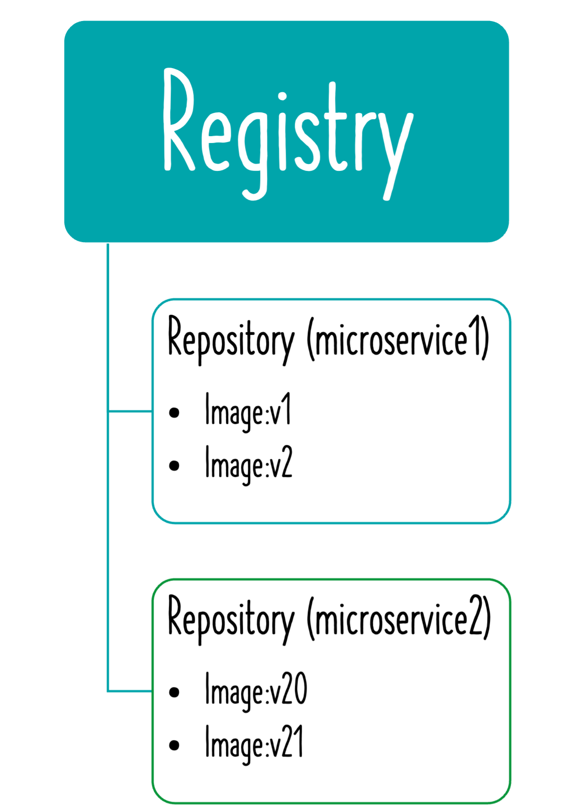

(Image in images folder: docker-registry.png. The image has white text. We need to redraw with black text.)

- Docker Image: A package representing specific version of your application (or software)
	- Contains everything your app needs
		- OS, software, code, dependencies
- Docker Registry: A place to store your docker images
- Docker Hub: A registry to host Docker images
- Docker Repository: Docker images for a specific app (tags are used to differentiate different images)
- Docker Container: Runtime instance of a docker image
- Dockerfile: File with instructions to create a Docker image

## Creating Docker Images - Dockerfile

```
FROM node:8.16.1-alpine
WORKDIR /app
COPY . /app
RUN npm install
EXPOSE 5000
CMD node index.js
```
- Dockerfile contains instruction to create Docker images
	- FROM - Sets a base image
	- WORKDIR - sets the working directory
	- RUN - execute a command
	- EXPOSE - Informs Docker about the port that the container listens on at runtime
	- COPY - Copies new files or directories into image
	- CMD - Default command for an executing container

## Docker Based Services

Pickup From

https://raw.githubusercontent.com/in28minutes/learning-paths-cloud-and-devops/main/00-cloud-made-easy/3%20-%20Docker.svg


# Container Orchestration (Reuse from Kubernetes Article)

## Microservices have complex needs

`Diagram: Microservice 1 > Microservice 2 > Microservice 3 > Microservice 4 > Microservice 5`

- Enterprises are heading towards microservices architectures
- Approach: Build small focused microservices instead of large applications
- Why?
	- Innovation because of Faster Release Cycles
	- Flexibility to build applications in different programming languages (Go, Java, Python, JavaScript,  etc)
	- Flexibility in scaling
- Cost of Flexibility: Complex Needs

## Need for Container Orchestration(13.gif)

- Requirement : I want 10 instances of Microservice A container, 15 instances of Microservice B container and ....
- Typical Features:
	- Auto Scaling - Scale containers based on demand
	- Service Discovery - Help microservices find one another
	- Load Balancing - Distribute load among multiple instances of a microservice
	- Self Healing - Do health checks and replace failing instances
	- Zero Downtime Deployments - Release new versions without downtime

## Container Orchestration Options
- Cloud Specific
	- AWS Elastic Container Service (ECS) 
	- AWS Fargate : Serverless version of AWS ECS
- Cloud Neutral - Kubernetes
	- AWS - Elastic Kubernetes Service (EKS)
	- Azure - Azure Kubernetes Service (AKS)
	- Google Cloud - Google Kubernetes Engine (GKE)
- Multi Cloud Kubernetes
	- AWS - Amazon EKS Anywhere
	- Azure - Azure Arc
	- Google Cloud - Anthos

## Anything we can add from here

https://www.youtube.com/watch?v=w-3wnG3J1Rs&list=PLBBog2r6uMCQgjZrb1auB1VdMrS-YqYzz&index=4

https://raw.githubusercontent.com/in28minutes/learning-paths-cloud-and-devops/main/00-cloud-made-easy/4%20-%20Kubernetes.svg

# Serverless

Video - https://www.youtube.com/watch?v=SLBEG6uuy4Q&list=PLBBog2r6uMCQgjZrb1auB1VdMrS-YqYzz&index=5

## Why Serverless?

- Your responsibilities when Using IaaS to deploy an application?
	- Creating VMs
	- Setup Application Runtime
	- Deploy Application Code 
	- Configure load balancing
	- Configure Application Scaling
	- Ensure High Availability
	- Take care of OS upgrades and patches
	- etc.. ( and a lot of things!)
- What do we think about when we develop an application?
	- Where to deploy? What kind of server? What OS?
	- How do we take care of scaling and availability of the application?
	- etc.. ( and a lot of things!)
- What if you don't worry about servers and focus ONLY on code?
	- Enter Serverless
	- Remember: Serverless does NOT mean "No Servers"
	- Serverless is about reducing your responsibilities to a minimum!

## Serverless for me

- You don't worry about infrastructure (ZERO visibility into infrastructure)
	- Flexible scaling and automated high availability
- Most Important: Pay for use
	- Ideally ZERO REQUESTS => ZERO COST
- You focus on code and the cloud managed service takes care of all that is needed to scale your code to serve millions of requests!
	- And you pay for requests and NOT servers!
- Key Features:
	- 1: Zero worry about infrastructure, scaling and availability
	- 2: Zero invocations => Zero Cost (Can you scale down to ZERO instances?)
	- 3: Pay for invocations and NOT for instances (or nodes or servers)
- Serverless Levels:
	- Serverless Level 1: Features (1 + 2)
	- Serverless Level 2: Features (1 + 2 + 3)
- When I refer to Serverless, I'm referring to Level 2
- HOWEVER cloud providers include managed services at Level 1 and Level 2:
	- Level 1: Google App Engine (Google Calls it "App Engine is a fully managed, serverless platform"), AWS Fargate (AWS calls it "serverless compute engine for containers")
		- Scale down to ZERO instances when there is no load, BUT you pay for number (and type) of instances running!
	- Level 2: Google Cloud Functions, AWS Lambda, Azure Functions etc
		- You pay for invocations

## Serverless - Remember

- Beyond Functions: Serverless computing extends beyond just function-as-a-service platforms like AWS Lambda, Azure Functions, and Google Cloud Functions.
- Serverless Databases: Databases such as AWS DynamoDB, Azure Cosmos DB, and Google Cloud Firestore offer scalable, on-demand database services without managing infrastructure.
- Serverless Queuing: Services like AWS SQS, Azure Queue Storage, and Google Cloud Pub/Sub provide queuing services for asynchronous task management.
- Expanding Ecosystem: Cloud providers continue to expand their serverless offerings, encompassing areas like machine learning, media services, and more.
- Remember: Serverless architectures allow developers to build and run applications and services without thinking about servers. 

# Compute Options in Cloud

Video - https://www.youtube.com/watch?v=U9WbyWXrPxI&list=PLBBog2r6uMCQgjZrb1auB1VdMrS-YqYzz&index=6

https://raw.githubusercontent.com/in28minutes/learning-paths-cloud-and-devops/main/00-cloud-made-easy/6%20-%20Compute.svg


# Unstructured Data

Video - https://www.youtube.com/watch?v=3cWS58Odzro&list=PLBBog2r6uMCQgjZrb1auB1VdMrS-YqYzz&index=7

## Getting Started

We can reuse from earlier article - Types of Storage (4.gif)
- Overview
- Use Cases
- Cloud Services

- Data which does not have any structure (Audio files, Video files, Binary files)
	- What is the type of storage of your hard disk?
		- Block Storage (Azure Disks, Amazon EBS, Google Cloud Persistent Disk)
	- You've created a file share to share a set of files with your colleagues in a enterprise. What type of storage are you using?
		- File Storage (Azure Files, Amazon EFS, Google Cloud Filestore)
	- You want to be able to upload/download objects using a REST API without mounting them onto your VM. What type of storage are you using?
		- Object Storage (Azure Blob Storage, Amazon S3, Google Cloud Storage)
- NOTE: Same App - Multiple types of Data - Youtube 

## Block Storage

- Use case: Harddisks attached to your computers
- Typically, ONE Block Storage device can be connected to ONE virtual server
	- (EXCEPTIONS) You can attach read only block devices with multiple virtual servers and certain cloud providers are exploring multi-writer disks as well!
- HOWEVER, you can connect multiple different block storage devices to one virtual server
- Used as:
	- Direct-attached storage (DAS) - Similar to a hard disk
	- Storage Area Network (SAN) - High-speed network connecting a pool of storage devices
		- Used by Databases - Oracle and Microsoft SQL Server

## File Storage	

- Media workflows need huge shared storage for supporting processes like video editing
- Enterprise users need a quick way to share files in a secure and organized way
- These file shares are shared by several virtual servers


# Identity Management in the cloud

## Typical identity management in the cloud

- You have resources in the cloud (examples - a virtual server, a database etc)
- You have identities (human and non-human) that need to access those resources and perform actions 
	- For example: launch (stop, start or terminate) a virtual server
- How do you identify users in the cloud?
	- How do you configure resources they can access? 
	- How can you configure what actions to allow?
- Authentication (is it the right user?)
	- Using Corporate Account
	- Using Gmail Account
	- Finger scan
- Authorization (do they have the right access?) 
	- Delete a Virtual Machine
	- Create a Virtual Machine
	- Create a Specific Database
	- Read a File Share
- Typically we need very granular control
	- Limit a single user:
		- to perform single action
		- on a specific cloud resource
		- from a specific IP address
		- during a specific time window
- In Cloud: *Identity and Access Management Services* provides this important functionality
	- AWS: Identity and Access Management
	- Azure: Azure Identity Management
	- Google Cloud: Identity and Access Management

# Data Encryption 

## Data States

- Data at rest: Stored on a device or a backup 
	- Examples : data on a hard disk, in a database, backups and archives
- Data in motion: Being transferred across a network
	- Also called Data in transit
	- Examples : 
		- Data copied from on-premise to cloud storage
		- An application in a VPC talking to a database
	- Two Types:
		- In and out of Cloud
		- Within Cloud
- Data in use: Active data in a non-persistent state
	- Example: Data in your RAM

## Encryption

- If you store data as is, what would happen if an unauthorized entity gets access to it?
	- Imagine losing an unencrypted hard disk
- First law of security : Defense in Depth
- Typically, enterprises encrypt all data 
	- Data on your hard disks
	- Data in your databases
	- Data on your file servers
- Is it sufficient if you encrypt data at rest? 
	- No. Encrypt data in transit - between  application to database as well.

## Symmetric Key Encryption

- Symmetric encryption algorithms use the same key for encryption and decryption
- Key Factor 1: Choose the right encryption algorithm
- Key Factor 2: How do we secure the encryption key?
- Key Factor 3: How do we share the encryption key?

## Asymmetric Key Encryption

We need to re-draw this image as this is from wikipedia!

 

- Two Keys : Public Key and Private Key
- Also called Public Key Cyptography
- Encrypt data with Public Key and decrypt with Private Key
- Share Public Key with everybody and keep the Private Key with you(YEAH, ITS PRIVATE!)
- No crazy questions:
	- Will somebody not figure out private key using the public key?
- How do you create keys in the cloud?
	- AWS: AWS KMS
	- Azure: Azure Key Vault 
	- Google Cloud: Cloud KMS and Cloud HSM

# Networking in the Cloud

Video - https://www.youtube.com/watch?v=nBwDFt1LHCg&list=PLBBog2r6uMCQgjZrb1auB1VdMrS-YqYzz&index=11

## Understanding need for a Virtual Network (or Virtual Private Cloud)
<!-- .slide: class="image-right image-thirty" -->

- In a corporate network or an on-premises data center:
	- Can anyone on the internet see the data exchange between the application and the database? 
		- No
	- Can anyone from internet directly connect to your database? 
		- Typically NO. 
		- You need to connect to your corporate network and then access your applications or databases.
- Corporate network provides a secure internal network protecting your resources, data and communication from external users
- How do you do create your own private network in the cloud?
	- Create a Virtual Network (or a Virtual Private Cloud)
- Virtual Network Solutions in the Cloud:
	- AWS: Amazon Virtual Private Cloud (VPC)
	- Azure: Azure Virtual Network
	- Google Cloud: Virtual Private Cloud

## Understanding Need for Subnets
- Different resources are created on cloud - databases, compute (EC2) etc
- Each type of resource has its own access needs
- Public Load Balancer's are accessible from internet (public resources)
- Databases or Virtual Machine instances should NOT be accessible from internet
	- ONLY applications within your network (VPC) should be able to access them(private resources)
- How do you separate public resources from private resources inside a VPC?
- (Solution) Create different subnets for public and private resources
	- Resources in a public subnet CAN be accessed from internet
	- Resources in a private subnet CANNOT be accessed from internet
	- BUT resources in public subnet can talk to resources in private subnet


## Network Address Translation(NAT) Instance and Gateway
- How do you **allow instances in a private subnet to download software updates** and security patches while denying inbound traffic from internet?
- How do you allow instances in a private subnet to **connect privately to other cloud Services** outside the VPC?
	- **NAT Gateway**: Managed Service

## Connecting Cloud to Enterprise Data Center

- Most enterprises use Hybrid Cloud
- Options: Shared Connection and Azure ExpressRoute
	- **Shared Connection**: Encrypted connection from on-premises to Cloud Platform over internet
		- Needs VPN device or gateway on-premises
		- Need  VPN gateway in the Virtual Network or Virtual Private Cloud
		- Typically encrypted communication over Internet (public)
	- **Dedicated Connection**: Private connectivity to Azure Virtual Network
		- Provides very high bandwidth
		- Very high security (private connection)
		- Traffic does NOT go over internet
		- Traffic is NOT encrypted by the connection


## Networking - An Overview

https://raw.githubusercontent.com/in28minutes/learning-paths-cloud-and-devops/main/00-cloud-made-easy/11%20-%20Networking.svg

# Cloud Fundamentals

## Public Cloud
- You host everything in the cloud (You DO NOT need a data center anymore)
	- No Capital Expenditure required
- Hardware resources are owned by cloud platform
	- Hardware failures and security of the data center are managed by cloud platform
- Summary: Hardware owned by cloud platform and shared between multiple tenants
    - Tenants: Customers who rent infrastructure (You, Me and other enterprises)

## Private Cloud
- You host everything in your own data center
    - Needs Capital Expenditure
    - Incur staffing and maintenance expenses for infrastructure
- Delivers higher level of security and privacy

## Hybrid Cloud: 
- Combination of both (Public & Private)
    - Use Public Cloud for some workloads and Private cloud for others
    - Example: Connecting an on-premise app to a cloud database
- Provides you with flexibility: Go on-premises or cloud based on specific requirement


# DevOps (Edit Previous Article Please)
VIDEO : https://www.youtube.com/watch?v=rM76t6ksPrQ

## Software development life cycle (SDLC) - Waterfall

- Software development in multiple long phases:
	- Requirements
	- Design
	- Implementation
	- Testing
	- Deployment

## Software development life cycle (SDLC) - Spiral
- Software development in smaller iterations:
	- Start
	- Iteration 1
	- Iteration 2
	- ...
	- Interation n-1
	- Product v1

## Software development life cycle (SDLC) - Agile

### Typical Agile Process (Each phase is repeated in a cycle)
- Plan: This is the first phase where the requirements are gathered, and a plan is made for the upcoming iteration of the product.
- Code: Based on the plan, the actual coding or programming of the software takes place.
- Build: The code is compiled or built into a runnable instance of the software.
- Test: The built software is then tested to ensure it meets the required standards and is free of defects.
- Release: After testing, the software is released into a staging or production environment for deployment.
- Deploy: The release is then deployed to the production environment where it can be accessed by users.
- Review: After deployment, the software's performance is reviewed. This can include gathering user feedback, monitoring software performance, and identifying areas for improvement.
- Back to Plan: Insights and feedback from the review are taken into account, leading back to the planning phase for the next iteration of development.

### Agile Principles

- Individuals and interactions over processes and tools
- Working software over comprehensive documentation
- Customer collaboration over contract negotiation 
- Responding to change over following a plan
- Now there are 12 principles (https://agilemanifesto.org/principles.html)

### My Recommendation

- Agile is recommended for most software development:
	- BUT add a bit of rigidity from waterfall model for critical safety software (Flight navigation software, Medical devices software etc)

## Team: Business, Dev, Test, Operations

https://raw.githubusercontent.com/in28minutes/learning-paths-cloud-and-devops/683aa9d8f40b9240a283aed19f30f5d7c3e671be/00-cloud-made-easy/DevOps-For-Beginners.svg

## DevOps (Reuse from earlier articles and expand as needed)

- Getting Better at "Three Elements of Great Software Teams"
	- Communication - Get teams together
	- Feedback - Earlier you find a problem, easier it is to fix
	- Automation - Automate testing, infrastructure provisioning, deployment, and monitoring

## DevOps - CI, CD

- How do you get quick feedback?
	- Do things continuously in small iterations!
- Continuous Integration
	- Continuously run your tests and packaging
- Continuous Delivery 
	- Continuously deploy to test environments
	- Deployment to production is a manual decision
- Continuous Deployment
	- Continuously deploy to production

## CI, CD in depth

- **Code Commit**: The process starts with developers committing code to the version control repository.
- **Unit Tests**: Committed code then undergoes unit testing, where individual parts of the application are tested to ensure they work correctly.
- **Integration Tests**: After unit tests, integration tests are run to ensure that the different parts of the application work together as expected.
- **Package**: The application is then packaged, which means compiling the code and assembling all the parts into a deployable artifact.
- **Deploy**: This artifact is deployed to a testing or staging environment.
- **Automated Tests**: Once deployed, automated tests are executed. These could include functional tests, performance tests, and other types of automated tests to verify the behavior of the application in a simulated production environment.
- **Testing Approval**: If the automated tests pass, the build can be marked as ready for production. This may involve a manual approval process.
- **Deploy NEXT**: If testing approval is given, the next step is to deploy to the production environment. 

The process does not end here and will loop back to the beginning for the next set of changes, continuing the cycle of Continuous Delivery!

## Popular CI, CD Tools

- Free/Open Source
	- Jenkins: An open-source automation server that can be used to automate all sorts of tasks related to building, testing, and delivering or deploying software.
	- GitHub Actions: This is the CI/CD tool provided by GitHub. It allows for automation of workflows, including testing and deployment, directly within a GitHub repository.
	- Argo CD: A declarative, GitOps continuous delivery tool for Kubernetes.
- AWS
	- AWS CodeBuild: A fully managed continuous integration service that compiles source code, runs tests, and produces software packages.
	- AWS CodeDeploy: A deployment service that automates application deployments.
	- AWS CodePipeline: A continuous delivery service that automates the build, test, and deploy phases of your release process.
- Azure:
	- Azure Pipelines (Azure DevOps): Provides cloud-hosted pipelines capable of building and deploying to any cloud or on-premises.
- Google Cloud:
	- Google Cloud Build: Build, test, and deploy on Google Cloud serverless CI/CD platform.
	- Google Cloud Deploy: Deliver continuously to Google Kubernetes Engine and Anthos.

## Getting Stared with Infrastructure as Code

- Lets consider an example:
	- I would want to create a new VPC and a subnet
	- I want to provision a load balancer with 5 virtual machines and a database
	- I would want to install Python on one virtual machine
	- AND I would want to create 4 environments 
		- Dev, QA, Stage and Production!
- Doing this manually:
	- Will take time and there is every chance you will make a mistake
- How about automating this?
	- Infrastructure as Code
- Infrastructure as Code: Automate Provisioning & Configuration of Resources (in cloud, most of the times)

## Infrastructure as Code in Depth
- Create Template: Define your application's infrastructure with code outlining all required components.
- Provision Server: Automatically set up a server as specified in your infrastructure code.
- Install Software: Load the server with all the software it needs to run your application.
- Configure Software: Adjust software settings to meet the application’s operational requirements.
- Deploy App: Place your application on the server to prepare it for use.

## Infrastructure as Code - Two Parts

- 1: Infrastructure Provisioning: Provision cloud resources
- 2: Configuration Management: Install right software and tools

## Infrastructure as Code - Infrastructure Provisioning

- Infrastructure Provisioning: Provision cloud resources
- Cloud neutral:
	- Terraform (templates): Write declarative configuration files that can manage resources across multiple cloud providers.
	- Pulumi (code): Use general-purpose programming languages to define cloud resources.
- AWS:
	- AWS CloudFormation - Provision Resources using JSON/YAML templates
	- AWS Cloud Development Kit (AWS CDK) - Provision resources using popular programming languages
	- AWS Serverless Application Model (SAM) - Provision Serverless Resources
- Google Cloud:
	- Google Cloud Deployment Manager - Provision resources using declarative templates
- Azure:
	- Azure Resource Manager (ARM) Templates - Define and manage resources with JSON templates
	- Azure Bicep - Define infrastructure as code with a domain-specific language

## Infrastructure as Code - Configuration Management

- Configuration Management: Install the right software and tools on hundreds of cloud resources
- Open Source Tools:
	- Chef, Puppet, Ansible, SaltStack
- AWS: OpsWorks (Chef, Puppet in AWS)
- Google Cloud: Google Cloud Marketplace solutions (Chef, Puppet, Ansible, SaltStack)
- Azure: Azure Automation - Automate using PowerShell and Python

## Infrastructure as Code - Best Practice
- Treat infrastructure the same way as application code
	- Track infrastructure changes over time (versioning)
	- Bring repeatability into your infrastructure
	- Advantages:
		- Automate deployment of resources in a controlled, predictable way
		- Avoid mistakes with manual configuration

## Observability

Notes from here - https://raw.githubusercontent.com/in28minutes/learning-paths-cloud-and-devops/683aa9d8f40b9240a283aed19f30f5d7c3e671be/00-cloud-made-easy/DevOps-For-Beginners.svg

## Standardization (Give a Quick Intro and Refer to Container and Container Orchestration Articles)

Notes from here - https://raw.githubusercontent.com/in28minutes/learning-paths-cloud-and-devops/683aa9d8f40b9240a283aed19f30f5d7c3e671be/00-cloud-made-easy/DevOps-For-Beginners.svg


# Cloud Cost Management

## Total Cost of Ownership(TCO)

- Total Cost of Ownership(TCO) includes:
	- Infrastructure Costs
		- Procuring Servers, Databases, Storage, Routers ..
		- Infrastructure maintenance costs
	- Licensing Costs (Software + Hardware)
	- Networking Costs (Connection cost + Data Ingress + Data Egress)
	- Personnel Costs (Dev + Test + Ops + Business + ..)
	- Other Costs:
		- Penalties for missed SLAs or Compliance needs
		- Third Party APIs
		- Electricity costs
- When designing solutions (or migrating to cloud), ensure that you take Total Cost of Ownership(TCO) into account!
	- Compare Apples to Apples!

## Expenditure Models: CapEx vs OpEx

- Capital Expenditure (CapEx): Money spent to buy infrastructure
	- Additional cost to maintain infrastructure with time
	- You might need a team to manage the infrastructure
	- Example: Deploying your own data center with physical servers
	- Example: Purchasing Reservations
	- Example: Leasing Software
- Operational Expenditure (OpEx): Money spent to use a service or a product
	- Zero upfront costs
	- You Pay for services as you use them (Pay-as-you-go model)
	- Example: Provisioning VMs as you need them
	- Example: Using Serverless FaaS and paying for invocations

## Pricing Models - Consumption-based vs Fixed 

- Consumption-based - You are billed for only what you use
	- Example: Serverless FaaS - You pay for no of invocations!
- Fixed-price - You are billed for instances irrespective of whether they are used or not
	- Example: You provision a VM instance 
		- You pay for its lifetime irrespective of whether you use it or NOT
	- Example: You provision a Kubernetes cluster
		- You are billed irrespective of whether you use it or not

# Data Analytics

## Introduction to Data Analytics

- Goal: Convert raw data to intelligence 
	- Uncover trends and discover meaningful information
	- Find new opportunities and identify weaknesses
	- Increase efficiency and improve customer satisfaction
	- Make appropriate business decisions
- Raw data can be from different sources:
	- Customer purchases, bank transactions, stock prices, weather data, monitoring devices etc
- Example: Decide future sales using past customer behavior
- Example: Faster diagnosis & treatment using patient history


## Big Data - Terminology and Evolution

### 3Vs of Big Data
- Volume: Terabytes to Petabytes to Exabytes
- Variety: Structured, Semi structured, Unstructured
- Velocity: Batch, Streaming ..

### Data warehouse
- Data warehouse: Execute queries processing petabytes of data in seconds
	- Data stored in a format ready for specific analysis! (processed data) 
		- Examples: Teradata, BigQuery(Google Cloud), Redshift(AWS), Azure Synapse Analytics

### Data lake
- Data lake: Typically retains all raw data (compressed)
	- Typically object storage is used as data lake
		- Amazon S3, Google Cloud Storage, Azure Data Lake Storage Gen2 etc..
- Advantages:
	- Flexibility while saving cost
	- Perform ad-hoc analysis on demand
	- Analytics & intelligence services (even data warehouses) can directly read from data lake
		- Azure Synapse Analytics, BigQuery(Google Cloud), Amazon Athena etc..

## Data Analytics Work Flow

- Data Ingestion: Capture raw data 
	- From various sources (stream or batch)
		- Example: Weather data, sales records, user actions - websites ..
- Data Processing: Process data 
	- Raw data is not suitable for querying
		- Clean (remove duplicates), filter (remove anomalies) and/or aggregate data 
		- Transform data to required format (Transformation)
- Data Storage: Store to data warehouse or data lake
- Data Querying: Run queries to analyze data
- Data Visualization: Create visualizations to make it easier to understand data and make better decisions
	- Create dashboards, charts and reports (capture trends)
	- Help business spot trends, outliers, and hidden patterns in data

## Big Data Popular Tools 

### Apache Hadoop
- Apache Hadoop: Create datasets with variety of data. Get intelligence.
	- Runs on commodity servers with attached storage (Large clusters - thousands of nodes)
    - Hadoop Distributed File System (HDFS): Primary data storage
    - MapReduce: Write Java, Python, .. apps to process data 
        - Enables massive parallelization
    - HIVE: Query using SQL

### Apache Spark
- Apache Spark: How about processing in-memory?
    - Really fast: Can be up to 100 times faster than MapReduce (if you make sufficient memory available)
    - Supports Java, Python, R, SQL and Scala programming languages
    - Run data analytics, data processing and machine learning workloads
    - Has become very popular and is offered as a separate service in most cloud platforms!

### Databricks
- Databricks: Web-based platform for working with Spark
	- Centralized platform for machine learning, streaming analytics and business intelligence workloads
	- Founded by the creators of Apache Spark
	- Automated cluster management

## Batch vs Streaming Pipelines

### Batch Processing
- Batch Processing: Buffering and processing data in groups
	- Define condition - how often to run? (every 6 hours or after 10K records)
    - Advantages: Process huge volumes of data during off-peak hours (overnight, for example)
	    - Typically takes longer to run (minutes to hours to days)
    - Example: Read from storage, process, and write to Relational Database or NoSQL Database or Data warehouse

### Streaming Pipelines

- Streaming Processing: Real-time data processing
	- Processing data as it arrives (in seconds or milliseconds)
    - Examples: Stock Market Data, Telemetry from IOT Devices, User action metrics from websites

### Stream vs Batch Processing

|Feature|Batch|Streaming|
|--|:--|:--|
|Time Period|Process data in batches - all data from few hours to few days to few months|Process most recent data (last 30 seconds, for example).|
|Data Size|Process large datasets efficiently|Process individual records or micro batches containing a few records|
|Latency|High - Typically few hours|Low - Typically few seconds or milliseconds|
|Usecase|Use for performing complex storage or analysis|Used for storing individual records, simple aggregation or rolling average calculations|

# Machine Learning

## Where are we with AI?

- Artificial Intelligence is in its second golden phase (IMHO):
	- First Phase - Early successes in the 1960s and 1970s
	- Second Phase - Last two decades or so driven by:
		- New algorithms
		- Massive datasets
		- Powerful computing hardware
- HOWEVER, building AI solutions has NOT been easy:
	- Scarcity of skills
	- Need to create/manage massive datasets
	- Complex infrastructure needs
	- Complexity of managing AI models
- How can you use AI WITHOUT AI skills/complex infrastructure?
	- Use low-code AI platforms (AutoML)
	- Use pre-trained models (especially Generative AI models)

## Artificial Intelligence - All around you
- Self-driving cars
- Spam Filters
- Email Classification
- Fraud Detection

## What is AI? (Oxford Dictionary)

- *The theory and development of computer systems able to perform tasks normally requiring human intelligence, such as visual perception, speech recognition, decision-making, and translation between languages*
- Goal of AI: Create machines that can simulate human-like intelligence and behavior
	- Play Chess
	- Play Go
	- Make purchase decisions
	- Drive a car
	- Write an essay!

## Understanding Types of AI

- Strong artificial intelligence (or general AI): Intelligence of machine = Intelligence of human
	- A machine that can solve problems, learn, and plan for the future
	- An expert at everything
		- Including learning to play all sports and games!
	- Learns like a child, building on it's own experiences
	- We are far away from achieving this!
		- Estimates: few decades to never
- Narrow AI (or weak AI): Focuses on specific task
	- Example: Self-driving car
	- Example: Playing Chess
	- Example: Predicting House Price


## How does Generative AI work?

- Generative AI solutions MAY display inaccurate or offensive information
- BUT they does provide a lot of value if you understand their limitations and know when/how to use it
- How do Generative AI solutions work?
	- Artificial Intelligence
	- Machine Learning
	- Large Language Models
	- Foundation Models

## AI vs ML vs Generative AI

(Use our earlier image)

- Goal of AI: Create machines that can simulate human-like intelligence and behavior
	- What is ML?
	- How does Generative AI fit in?
- Let's get started on a Journey!


## Machine Learning vs Traditional Programming


Please redraw this image:
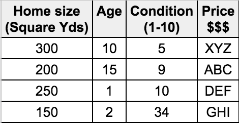


- Traditional Programming: Based on Rules
	- IF this DO that
	- Example: Predict price of a home
		- Design an algorithm taking all factors into consideration:
			- Location, Home size, Age, Condition, Market, Economy etc
- Machine Learning: Learning from Examples (NOT Rules)
	- Give millions of examples
	- Create a Model
	- Use the model to make predictions!

## Machine Learning - Making Prediction

Please redraw this image (black text):

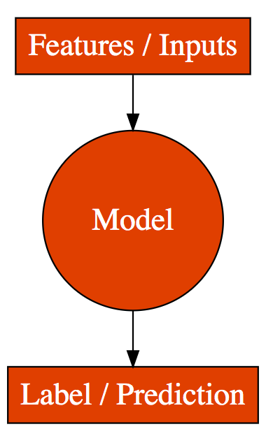

- Goal: Make a Good Prediction
	- Give inputs to a model
	- Model returns the prediction
	- Inputs are called Features
	- Prediction is called Label
	- Example: House Price Prediction Model
		- Label: price
		- Features:
			- area: Total area of house (m^2)
			- rooms: No. of rooms
			- bedrooms: No. of bedrooms
			- furniture: Is it furnished?
			- floor: Which floor?
			- age: How many years?
			- balcony: has balcony or not
			- garden: has garden or not

## Machine Learning - Features and Labels - Examples

- Used Car Price Prediction Model
	- Label: price
	- Features: manufacturer, year, model, age, condition, cylinders, location
- Spam Email Classification Model
	- Label: isSpam
	- Features: sender, subject, content
- Grant a Loan Model
	- Label: shouldWeGrantALoan
	- Features: doesOwnCar, doesOwnRealEstate, creditScore, isMarried, doesHaveChildren, totalIncome, totalCredit

## Machine Learning - Prediction Possibilities

- Numeric value: Label is a numeric value with a range of possibilities => Regression
	- Used Car Price Prediction
	- House Price Calculation
	- Predicting sea level
	- How much will it rain tomorrow?
- Limited Possibilities: YES or NO, 0 or 1, Type 1 or Type 2 or Type 3 => Classification
	- Spam Email, Grant a Loan, Determine the type of cloud	
	- Will it rain today?
- Summary:
	- Classification: Predicting category
	- Regression: Predicting numeric value


## Creating Machine Learning Models - Steps

- 1: Obtain Data
- 2: Clean Data
- 3: Feature Engineering: Identify Features and Label
- 4: Create a Model using the Dataset (and the ML algorithm)
- 5: Evaluate the accuracy of the model
- 6: Deploy the model for use

## Understanding Machine Learning Terminology

- Process
	- Training: The process of creating a model
	- Evaluation: Is the model working?
	- Inference: Using model to do predictions in production
- Dataset: Data used to create, validate & test the model
	- Features: Inputs
	- Label: Output/Prediction
	- Dataset Types
		- Training Dataset: Dataset used to create a model 
		- Validation Dataset: Dataset used to validate the model (and choose the right algorithm) - Model Evaluation
		- Testing Dataset: Dataset used to do final testing before deployment

## THE AI Turmoil

- Quotes:
	- I am really quite close, I am very close, to the cutting edge in AI and it scares the hell out of me - Elon Musk
	- The development of full artificial intelligence could spell the end of the human race. It would take off on its own, and re-design itself at an ever-increasing rate. Humans, who are limited by slow biological evolution, couldn't compete and would be superseded. - Stephen Hawking
- No one knows the truth:
	- Most predictions about AI turned false in the last few decades!
- What's the pragmatic way to think?
	- Don't fear AI
	- Learn to make the best use of it

## Generative AI - How is it different?

> Please use our earlier images for most Generative AI Concepts

- Artificial Intelligence: Create machines that can simulate human-like intelligence and behavior
	- Machine Learning: Learning from examples
		- Generative AI: Learning from examples to create new content

## Generative AI - Generating New Content

- Goal: Generating New Content
	- Instead of making predictions, Generative AI focuses on creating new data samples
	- Examples:
		- Text Generation: Writing e-mails, essays & poems. Generating ideas.
		- Writing Code: Write, debug & analyze programs
		- Images Generation: Creating paintings, drawings, or other forms of images
- How else is Generative AI different?
	- Let's find out!

---
## Generative AI - Needs Huge Volumes of Data

- Generative AI models: Statistical models that learn to generate new data by analyzing existing data
	- More data analyzed => Better new data similar to existing data
	- Example: GPT-3 model was trained on a dataset of 500 billion words of text
- Datasets used include:
	- Images, text and code scraped from the open web:
		- Wikipedia
		- Books
		- Open source code (syntax of programming languages and the semantics of code)
		- Conversations

---
## Generative AI - Uses Self Supervised Learning

- Self-supervised learning: Model learns from the data itself 
	- WITHOUT requiring explicit labels or annotations
- How does this work?
	- Example for text model:
		- 1: Model tries to predict next word based on preceding words:
			- Model is given example sentence: "The sun is shining and the sky is ____."
			- Model predicts the missing word
		- 2: Model's predicted word is compared to the actual word that comes next:
			- Learns from its mistakes and adjusts its internal representations
				- Neural Networks, Loss Calculation, Backpropagation etc..
		- 3: Repeated for all text from training dataset
	- Model captures the relationships between words, contextual cues, and semantic meanings:
		- If prompted with "The sun is shining and the sky is," the model might generate:
			- "The sun is shining and the sky is clear."
			- "The sun is shining and the sky is blue."
			- "The sun is shining and the sky is filled -- with fluffy clouds."

---
## Key Step In Generative AI For Text - Next Word


- A key step in Generative AI For Text is predicting the next word
- During training, text based Generative AI models learn the probability that a word might occur in a specific context
	- Context: "The cat sat on the"
	- Example probabilities for next word:
		- "mat": 0.4, "table": 0.2, "chair": 0.2,  "moon": 0.1
	- Model might choose the highest probable word and go on to predict subsequent words
	- HOWEVER, you can control which of the words is chosen by controlling a few parameters!
		- temperature, top_k, top_p etc!

---
## Generative AI Text - Uses Tokens instead of Words

- TOKEN: A unit of text that might be a word
	- BUT it can be a sub word, punctuation mark, a number, ..
	- Why Tokens?
		- Tokens are more consistent than words
			- Words can have multiple meanings, depending on the context
				- "bank" might mean financial institution or a river bank
			- Tokens are more consistent
				- Example tokens: bank_river, bank_financial or light_verb, light_noun, ..
		- Tokens are smaller and more manageable
		- Tokens are more efficient to process
			- Because tokens are consistent, it easy for models to learn relationships and things like parts of speech
- Generative AI For Text Models:
	- Understand relationships between ~~Words~~ Tokens
	- Good at predicting Next ~~Word~~ Token!
	- Have a token limit on context and generated text
		- Example: 1,024 tokens or 4,096 tokens


---
## Generative AI Text - Uses SFT

- After basic training, Gen. AI Model can predict NEXT WORD in a sequence based on contextual information
	- Given: "My favorite sport is"
		- Model picks a probable word (basketball:20%, soccer:18%, cricket:10%)
	- Given: "A question?"
		- Model might follow up with "Another Question?"
- HOW to make model to respond to questions with answers?
	- Given a question, how to make the model give an answer
	- Solution: Supervised Fine-Tuning
- Model is trained with Labeled Data
	- 1000s of Prompt and Ideal Response combinations
	- Model learns to respond to a question with an answer
	- Surprisingly less number of prompts add this capability

## Generative AI Text - Uses RLHF

- How to make the model understand human values and preferences?
	- Models don't inherently understand human values, ethics, or preferences
	- Models can sometimes generate content that is inappropriate, biased, or conflicts with human values
	- How can we avoid this?
	- Solution: Reinforcement Learning from Human Feedback (RLHF)
- STEPS:
	- 1: Create a Reward Model that understands human values and preferences
	- 2: Tune Generative AI Model using Reward Model

## Generative AI Text - Uses RLHF - Step 1

- Goal: Build a Reward Model that understands human values and preferences
- How?
	- 1: Use Generative AI model to generate multiple responses for a prompt
	- 2: Diverse set of human evaluators rank the responses
	- 3: Tune Reward Model based on the responses from human evaluators
	- Repeat 1, 2, 3 for thousands of prompts 
- Result: Reward Model understands human values and preferences (generates a Reward)!
	- It will be used later to tune the responses from the Generative AI model

## Generative AI Text - Uses RLHF - Step 2

- Goal: Tune Generative AI Model using Reward Model
- How?
	- 1: Feed a prompt into Generative AI Model to generate a response
	- 2: Calculate Reward using Reward Model
	- 3: Tune Generative AI Model based on the evaluation
	- Repeat 1, 2, 3 for millions of prompts (automated)
- Result: Generative AI Model understands human values and preferences!
- REMEMBER: You don't need to understand everything about SFT and RHLF

## Predictive Machine Learning vs Generative AI

 
| Feature |Predictive Machine Learning  | Generative AI | 
|--|:--|:--|
| Goal | Make a Good Prediction      | Generating New Content       |
| Input | Features          | Prompt   |
| Output | Prediction (Label)         | New Content |
| Use Cases | House Price Prediction, Fraud Detection, and more   | Text Generation, Code Generation, Music Composition,  and more |
| Volume of Training Data | Requires substantial labeled data | Requires significant amount of data |
| Time needed for Training | Training time can vary based on data size and complexity | Training time can be substantial for complex models |

## Generative AI - Foundation Models and LLMs

- Traditional ML Models:
	- Needed task specific training
	- Multiple tasks => Multiple trainings => Multiple models
- Foundation Models: Pre-Trained Multi Task Models
	- Trained once (called pre-training)
	- Same model can be used for multiple tasks
		- Chatbot
		- Classification
		- Summarization
	- Some models are multi modal as well: Text, video, audio, image...
- Large Language Models: Focused on text
	- REMEMBER: Subset of Foundation Models
	- Models that are trained on a lot of text to generate more text!

## Generative AI - Foundation Models

- From Bottom to Top:
	- Foundation Models:
		- OpenAI:
			- GPT (2, 3, 3.5, 4, 5, ..): Text, code and more..
			- DALL·E (1, 2, ...): Images
		- Open Source:
			- OpenLLaMA (Meta): Generate text, images, and code
		- Other Vendors: Google PaLM, ...
	- API:
		- OpenAI API
		- Azure OpenAI 
		- Google Cloud PaLM API, ...
	- Applications
		- ChatGPT
		- DALL·E
		- Bing Search, ...


## What are Embeddings?

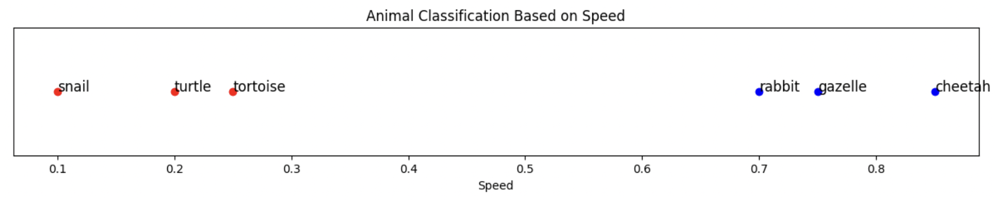 

- Embeddings: Vector representations of words in a high-dimensional space
	- Captures semantic relationships and contextual information
- Example: You can use multiple dimensions to represent animals:
	- Habitat: "aquatic," "terrestrial," or "arboreal."
	- Diet: "carnivore," "herbivore," or "omnivore."
	- Size: "small," "medium," or "large."
	- Movement: "flying," "running," "swimming," or "crawling."

## Exploring Embeddings with an Example

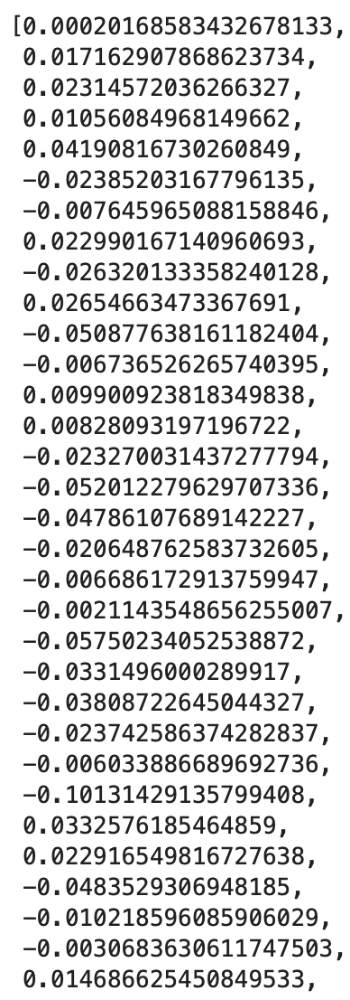 

- On the right is an embedding of a single word
	- OpenAI Embeddings API provides 1536-dimensional vector embeddings
	- i.e. Each word is being looked at from 1536 different dimensions
- Widely used in natural language processing (NLP) tasks
	- Text Similarity: Measure semantic similarity between texts
	- Recommendation Systems: Recommend items based on user preferences
	- Clustering: Group similar texts
	- Outlier Detection: Find text that does not fit the group
	- Example: Similarity Calculation
		- Given two sentences
			- "The sun is shining brightly." and "Cats and dogs are popular pets."
		- Calculate similarity between the sentence embeddings.
		- Higher similarity indicates semantic closeness.

## Machine Learning in Cloud - 10,000 Feet Overview

- Managed ML Services (ML as API):
	- Scalable, pre-trained APIs for common tasks: Natural Language Processing, Computer Vision, Speech Recognition, etc.
	- Generative AI APIs: Advanced APIs for creating new content, with minimal setup and maintenance.
- AutoML Solutions: User-friendly platforms for building custom models 
	- Minimal ML expertise needed.
	- Automated complex ML processes, e.g., model selection, training, and tuning.
	- Intuitive interfaces and integration with various data sources.
- Advanced ML Platforms: Advanced toolsets for complex models
	- For users with deep ML knowledge
	- Support for frameworks like TensorFlow, PyTorch
	- Features for distributed training and model serving

## Machine Learning in Cloud - Generic Landscape
 
| Category |AWS  | Azure | Google Cloud   |
|--|:--|:--|:--|
|Managed ML Services (APIs)| Amazon Translate, Amazon Polly, Amazon Lex, Amazon Transcribe, Amazon Rekognition...| Azure AI services (Search, Vision, Speech, Language,..)| Natural Language, Vision, Speech APIs|
|Generative AI APIs| Amazon Bedrock      |Azure OpenAI Service| Vertex AI >Generative AI Studio|
|AutoML Solutions| Amazon SageMaker Autopilot | Azure Machine Learning AutoML       |Vertex AI > Auto ML|
|Advanced ML Platform| Amazon SageMaker      | Azure Machine Learning|Vertex AI > Custom Training|


# Event Driven Architecture

- Microservices calling each other => Tight Coupling
- Event driven architectures: Microservices reacting to changes in state (events)
	- Example:
		- 1: Order Service publishes an OrderReceived event
		- 2: Billing Service receives it and publishes an OrderBilled event
		- 3: Warehouse Service receives it & publishes an OrderReadyToShip event
		- 4: Shipping Service receives it and publishes an OrderShipped event
		- 5: Email Service receives it and sends an email to the user
	- Advantages:
		- Loose Coupling: Microservices do not know about each other
		- Flexible Orchestration: Same event can be processed by multiple services
		- Resiliency: Events can be easily retried in case of failures
		- Asynchronous: A microservice does not need to wait for the consumer to process the event

# Observability and OpenTelemetry

- Observability: "measure the internal state of a system by examining its outputs"
	- Goal: Proactively identify problems and fix them
	- THREE PILLARS of observability: logs, metrics and traces
		- Earlier we had different standards for logs, metrics and traces
		- We also had very different approaches across languages
- How about ONE STANDARD ACROSS PLATFORMS?
	- OpenTelemetry: Collection of technologies (tools, APIs, SDKs) to collect and export telemetry - metrics, traces, and logs (https://opentelemetry.io)
		- Open standard
		- A CNCF - Cloud Native Computing Foundation - Project (Kubernetes is another CNCF project)
		- Almost every cloud platform supports OpenTelemetry
		- Steps to use OpenTelemetry:	
			- 1: Add OpenTelemetry libraries (for your specific language) to your project
			- 2: Instrument your code to export telemetry

## Observability

Observability is third topic in this video: https://www.youtube.com/watch?v=rM76t6ksPrQ

Notes from here - https://raw.githubusercontent.com/in28minutes/learning-paths-cloud-and-devops/683aa9d8f40b9240a283aed19f30f5d7c3e671be/00-cloud-made-easy/DevOps-For-Beginners.svg

# Digital Transformation

## What has changed in last decade or so?
- How consumers make purchase decisions? (Social)
- How we do things? (Mobile)
- How much data we have? (Big Data)
	- How much intelligence we can get? (AI/ML)
- How much access startups have to technology at scale? (Cloud)

## Enterprises have to adapt (or get disrupted)
- Enterprises can ADAPT by:
	- Providing awesome (omni-channel - social, mobile) customer experiences
	- Getting intelligence from data (Big Data, AI/ML)
		- Example: Personalize consumer offerings
	- Enabling themselves to make changes faster
		- Cultural change from "traditional Datacenter, SDLC,  manual IT Ops" to "Cloud, Containers, DevOps/SRE, Automation"
- Digital Transformation: Using modern technologies to create (or modify) business processes & customer experiences by innovating with technology and team culture
	- Focus on WHY (NOT HOW)
		- Increase pace of change
		- Revenue Growth
		- Cost Savings
		- Higher customer engagement/retention

## Cloud - Enabler for Digital Transformation

- Cloud can ENABLE Digital Transformations
	- Lower cost
	- Reduced responsibilities
	- Higher capabilities
	- Increased speed to market
- BUT needs a change in skills, mindset and culture
	- Modern Architectures (Microservices, Serverless, Containers, Kubernetes)
	- More Agile Processes (DevOps)
	- Right Talent
	- Right Culture (of data driven experimentation and innovation)

## Cloud Mindset

|Factor|Data Center|Cloud|
|--|:--|:--|
|Infrastructure|Buy|Rent|
|Planning|Ahead of time|Provision when you need it|
|Deployment|VMs | PaaS or Containers or Serverless|
|Team|Specialized skills| T-shaped skills|
|Releases|Manual|CI/CD with flexible release options <BR/>(Canary, A/B Testing, ....)|
|Infrastructure Creation|Manual|Infrastructure as Code|
|Attitude|Avoid Failures|Move Fast by Reducing Cost of Failure (Automation of testing, releases, infrastructure creation and monitoring)|

# Going Cloud Native

## What is Cloud Native?

- I would love to say that there is ONE definition for Cloud Native
	- HOWEVER there isn't one
- (MY DEFINITION): Cloud Native Architectures help you get the best value from the Cloud
	- GOOGLE CLOUD DEFINITION: Designed from the ground up to take advantage of the elasticity and distributed nature of the cloud 
- Goal: Increase software delivery velocity and increase service reliability while increasing collaboration among stakeholders

## Exploring Cloud Native Pillars

- Four Cloud Native Pillars
	- 1: Microservices
		- Fix issues and deliver new features quickly
			- Without impacting other services
	- 2: Containers
		- Portable - build once, run anywhere
			- Simplified consistent deployments
		- Lightweight (Faster deployments than VMs)
	- 3: Container Orchestration
		- Kubernetes (GKE) - Auto Scaling, Load Balancing, Self Healing, Zero Downtime Deployment etc
	- 4: DevOps (Dev + Ops, CI/CD, IaC)
		- Increased automation of processes
- Examples of NOT Cloud Native
	- Using VMs, Manual deployments, Creating infrastructure manually

## Monolith to Microservices: Application Modernization
- Prefer Managed Services
- Prefer Containers and Container Orchestration
- Prefer Stateless, Horizontally Scalable Microservices
- Use Automation (DevOps, SRE - CI/CD)
- Take a step by step approach:
	- Experiment and design proofs of concept
	- Replace application features with appropriate microservices in phases


# Cloud - Quick Review

## Challenges Before Cloud

- Low infrastructure utilization (PEAK LOAD provisioning)
- Needs ahead of time planning (Can you guess the future?)
- High cost of procuring infrastructure
- Dedicated infrastructure maintenance team (Can a startup afford it?)

## Idea Behind The Cloud

- How about provisioning (renting) resources when you want them and releasing them back when you do not need them? 
	- On-demand resource provisioning
	- Also called Elasticity

## Advantages of Cloud

- Trade "capital expense" for "variable expense"
- Benefit from massive economies of scale
- Stop guessing capacity 
- "Go global" in minutes
- Avoid undifferentiated heavy lifting
- Stop spending money running and maintaining data centers

# Regions and Zones (Existing Article to be updated)

Video - https://www.youtube.com/watch?v=3uuzV3lFgSc&list=PLBBog2r6uMCQgjZrb1auB1VdMrS-YqYzz&index=1&t=82s

## What is a Data Center?

## Need for Regions and Zones

- You deployed your application in only one data center!
	- What if the data center crashes?
	- What if a natural calamity happens in the area where the data center is present?
- STEP 1: What if I can distribute my application across multiple data centers in one geographic location?
- STEP 2: What if I can distribute my application across multiple geographic regions?

## What is a Region?

- (Problem) It is difficult for a startup to setup data centers across the world!
- (Solution) Cloud providers provides several regions around the world (expanding every year)
	- From India, you can create a server in Australia or Europe or United States ..
- Advantages (Reuse Existing Image)
	- High Availability
	- Low Latency
	- Global Footprint
	- Adhere to government regulations

## What is a Zone or an Availability Zones?

- Problem: How to achieve high availability in the same region (or geographic location)?
- Solution: Enter Zones (or Availability Zones - AZ)
	- One or more discrete data centers 
	- Each AZ has independent & redundant power, networking & connectivity
	- AZs in a region are connected through low-latency links
- (Advantage) Increased availability and fault tolerance within same region
	- Survive the failure of a complete data center


# Storing Data

- Data is the "oil of the 21st Century Digital Economy"
- Amount of data generated increasing exponentially
	- Mobile devices, IOT devices, application metrics etc
- Variety of
	- Data formats: Structured, Semi Structured and Unstructured
	- Data store options: Relational databases, NoSQL databases, Analytical databases, Object/Block/File storage ...
- How do you choose?
- Goal: Help you choose specific data format and the data store for your use case


## Data Formats & Data Stores

- Data formats: 
	- Structured: Tables, Rows and Columns (Relational)
	- Semi Structured: Key-Value, Document (JSON), Graph,  etc
	- Unstructured: Video, Audio, Image, Text files, Binary files ...
- Data stores: 
	- Relational databases
	- NoSQL databases
	- Analytical databases
	- Object/Block/File storage

## How To Choose between Data Stores?

- Data stores provide organized and persistent storage for your data
- To choose between different data stores, we would need to understand:
	- Availability
	- Durability
	- Scalability
	- Consistency
	- Transactions etc

## Database - Getting Started

> NOTE TO ANKIT: I've put sample images in place. Please re-draw them if you think they can be better.

### Step 1: One Database Instance in a Data Center

- Imagine a database deployed in a data center in London
- Let's consider some challenges:
	- Challenge 1: Your database will go down if the data center crashes or the server storage fails
	- Challenge 2: You will lose data if the database crashes

### Step 2: Database in a 2 Data Centers with Snapshots

- Let's automate taking copy of the database (take a snapshot) every hour to another data center in London
- Let's consider some challenges:
	- Challenge 1: Your database will go down if the data center crashes
	- Challenge 2 (PARTIALLY SOLVED): You will lose data if the database crashes
		- You can setup database from latest snapshot. But depending on when failure occurs you can lose up to an hour of data
	- Challenge 3(NEW): Database will be slow when you take snapshots

### Step 3: Add transaction logs


- Let's add transaction logs to database and create a process to copy it over to the second data center
- Let's consider some challenges:
	- Challenge 1: Your database will go down if the data center crashes
	- Challenge 2 (SOLVED): You will lose data if the database crashes
		- You can setup database from latest snapshot and apply transaction logs
	- Challenge 3: Database will be slow when you take snapshots

### Step 4: Add a Standby

- Let's add a standby database in the second data center with replication
- Let's consider some challenges:
	- Challenge 1 (SOLVED): Your database will go down if the data center crashes
		- You can switch to the standby database
	- Challenge 2 (SOLVED): You will lose data if the database crashes
	- Challenge 3 (SOLVED): Database will be slow when you take snapshots
		- Take snapshots from standby
		- Applications connecting to master will get good performance always

## Understanding Availability and Durability

### Fundamentals of Availability and Durability
- Availability
	- Will I be able to access my data now and when I need it?
	- Percentage of time an application provides the operations expected of it
- Durability
	- Will my data be available after 10 or 100 or 1000 years?
- Examples of measuring availability and durability:
	- 4 9's - 99.99
	- 11 9's - 99.999999999
- Typically, an availability of four 9's is considered very good
- Typically, a durability of eleven 9's is considered very good

### What is Good Availability?

| Availability | Downtime (in a month)  | Comment |
|--|--|--|
| 99.95% | 22 minutes||
| 99.99% (4 9's)| 4 and 1/2 minutes | Typically online apps aim for 99.99% (4 9's) availability|
| 99.999% (5 9's) | 26 seconds| Achieving 5 9's availability is tough|

### Why do we need very high Durability?


- What does a durability of 11 9's mean? 
	- If you store one million files for ten million years, you would expect to lose one file
- Why should durability be high?
	- Because we hate losing data
	- Once we lose data, it is gone

## Understanding Consistency

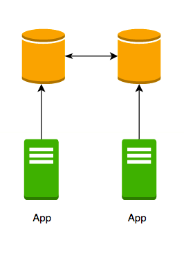
- Creating replicas => high availability & durability
- Consistency: Do you get the most recent, updated data irrespective of the copy you are querying against?
	- Having replicas of data makes consistency a challenge!
	- Strong Consistency: Changes immediately replicated to all replicas
		- You get same data from all replicas
		- Guaranteeing Strong Consistency with Multiple replicas => Slow inserts/updates
		- Needed in most transactional applications (banking, finance, ...)!
	- Eventual Consistency: A little lag - few seconds - before the change is available in all replicas
		- In the intermediate period, different replicas might return different values
		- Used when scalability is MORE important than data integrity
		- Ex: Social Media - Facebook status messages, Twitter tweets, LinkedIn posts etc

---
## What are Atomic Transactions?

- Atomic Transaction
	- Transaction: A unit of work
		- Involve multiple steps
		- Example: Transfer $10 from A to B
		- Step 1: Deduct $10 from A's account
		- Step 2: Add $10 to B's account
	- Atomicity: All or nothing changes
		- Across multiple rows/multiple tables
- Easier if all data is stored on one node:
	- Typical relational (SQL) databases stored data on one node => Strong support for atomic transactions
	- In most NoSQL databases, data is distributed across multiple nodes => Limited support or expensive atomic transaction support

## What is Scalability?
- A system is handling 1000 transactions per second
- 10 times load is expected next month
	- Can we handle a growth in users, traffic, or data size without any drop in performance?
	- Does ability to serve more growth increase proportionally with resources?
- Ability to adapt to changes in demand (users, data)
- What are the options that can be considered?
	- Deploy to a bigger instance with more CPU, memory, ...
	- Create more instances
	- ...

## Vertical Scaling vs Horizontal Scaling

Please recreate both these images
 

- Vertical Scaling: Deploying to bigger instance
	- A larger hard drive or A faster CPU
	- More RAM, I/O, or networking capabilities
- Horizontal Scaling: Using multiple instances:
	- Example: Use multiple VMs
	- Example: Split database data in multiple nodes
- Key Observations:
	- Vertical scaling has limits
	- Vertical scaling can be expensive
	- Horizontal Scaling can be complex:
		- Compute: Load Balancers etc.
		- Databases: How to split data? (and a lot of other questions!)

## Vertical Scaling vs Horizontal Scaling for Databases

 


- Vertical Scaling: Deploying to bigger instance
	- Limits on max amount of data - ex: 64TB
	- Typical relational databases (MySQL etc.) only support vertical scaling for writes
- Horizontal Scaling: Using multiple instances
	- Most NoSQL databases scale horizontally
	- NOT all NoSQL databases provide Strong Consistency
	- Most NoSQL databases provide limited (or expensive) support for atomic transactions
	- Some specially designed modern relational databases support worldwide horizontal scaling and strong transactions (Amazon Aurora, Cloud Spanner)

## Database Steps - Continued

### Step 5: Adding Reporting and Analytics Applications


- New reporting and analytics applications are being launched using the same database
	- These applications will ONLY read data
- Within a few days you see that the database performance is impacted
- How can we fix the problem?
	- Vertically scale the database - increase CPU and memory
	- Create a database cluster (Distribute the database) - Typically database clusters are expensive to setup
	- Create read replicas - Run read only applications against read replicas

### Step 6: Adding a Read Replica
<!-- .slide: class="image-right image-forty" -->

- Add read replica
- Connect reporting and analytics applications to read replica
- Reduces load on the master databases
- Upgrade read replica to master database (supported by some databases)
- Create read replicas in multiple regions
- Take snapshots from read replicas

## Horizontal Partitioning vs Vertical Partitioning
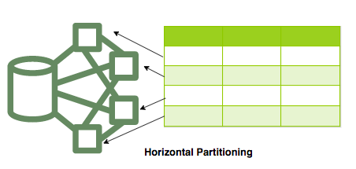
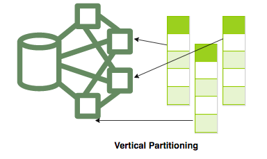
- Partitioning: Divide Tables => Many Small Parts
	- Horizontal Partitioning: Rows distributed across partitions
		- (Typically) A partition key used to distribute rows
		- Great for online apps (social media, for example) needing huge scale
			- Quick updates: Entire row stored in a partition
			- Scales well: No limits on how much data can be stored
		- Multi row transactions can be expensive:
			- Data divided in multiple partitions
	- Vertical Partitioning: Data distributed by columns
		- Each table column is stored together
		- Great for analytics and data warehouses
			- High compression - Store petabytes of data efficiently
			- Faster Queries - Execution split across multiple nodes
		- NOT so great for online/transactional apps
			- Slow Updates - Updating single row involves updating multiple nodes

## Exploring Data Stores - Check Your Understanding
<!-- .slide: class="tdfragment" -->
| Scenario | Solution  | 
|--|:--|
|What is good Availability?|99.99% (4 9's) - 4 and 1/2 minutes of downtime in a month <BR/>99.999% (5 9's) - 26 seconds of downtime in a month|
|What is good Durability?|Typically, 11 9's durability (99.999999999%) is expected. Once we lose data, it is gone.|
|What are we measuring here? <BR/>"Do you get the most recent, updated data irrespective of the copy you are querying against?"|Consistency|
|What are some of challenges with scaling Databases horizontally?|Ensuring Strong Consistency. Supporting Atomic Transactions.|
|What is Eventual Consistency?|A little lag - few seconds - before updates/inserts are available in all replicas. In the intermediate period, different replicas might return different values|

## Structured Data - Relational Databases
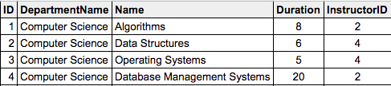


- Data stored in Tables - Rows & Columns
- Predefined schema - Tables, Relationships and Constraints
- Define indexes - Query efficiently on all columns
- Used for 
	- OLTP (Online Transaction Processing) use cases and
	- OLAP (Online Analytics Processing) use cases

## Relational DB - OLTP (Online Transaction Processing)

- OLTP: Applications where large number of users make large number of transactions
	- Transaction - small, discrete, unit of work (Ex: Transfer money to your friend's account)
	- Heavy writes and moderate reads
	- Quick processing expected
- Use cases: Most traditional applications - banking, e-commerce, ..
- Cloud Managed Services: 
	- AWS: Amazon RDS (Aurora/PostgreSQL/MySQL/MariaDB/Oracle/SQLServer)
	- Azure: Azure SQL Database (SQL Server), Azure Database for MySQL/PostgreSQL/MariaDB
	- Google Cloud: Cloud SQL (MySQL/PostgreSQL/SQL Server), Cloud Spanner

## Relational DB - OLAP (Online Analytics Processing)
- OLAP: Applications allowing users to analyze/query petabytes of data
	- Examples: Reporting applications, Data warehouses, Business intelligence applications, Analytics systems
	- Data is consolidated from multiple (typically transactional) databases
	- Sample application : Decide insurance premiums analyzing data from last hundred years	
- Cloud Managed Services:
	- Amazon Redshift
	- Azure Synapse Analytics
	- BigQuery (Google Cloud)
- Manage petabytes of data and run queries efficiently 

## Relational Databases - OLAP vs OLTP
<!-- .slide: class="image-right image-forty" -->


- OLAP and OLTP use similar data structures
- BUT very different approach in how data is stored
- OLTP databases use row storage 
	- Each table row is stored together
	- Efficient for processing small transactions
- OLAP databases use columnar storage
	- Each table column is stored together
	- High compression - store petabytes of data efficiently
	- Distribute data - one table in multiple cluster nodes 
	- Execute single query across multiple nodes - Complex queries can be executed efficiently

## Semi Structured Data
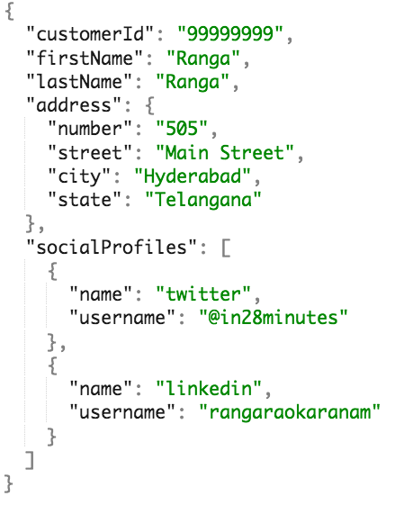

- Data has some structure BUT not very strict
- Semi Structured Data is stored in NoSQL databases
	- NoSQL = not only SQL
	- Flexible schema
		- Structure data the way your application needs it
		- Let the structure evolve with time
	- Horizontally scale to petabytes of data with millions of TPS
- Types of Semi Structured Data: 
	- Document
	- Key Value
	- Graph 
	- Column Family

## Semi Structured Data - 1 - Document 

- Data stored as collection of documents
	- Typically JSON (Javascript Object Notation)
		- Be careful with formatting (name/value pairs, commas etc)
		- address - Child Object - `{}`, socialProfiles - Array - `[]`
	- Documents are retrieved by unique id (called the key)
		- Typically, you can define additional indexes
		- Documents don't need to have the same structure
			- No strict schema defined on database
			- Apps should handle variations (application defined schema)
	- Typically, information in one document would be stored in multiple tables, if you were using a relational database
- Use cases: Product Catalog, Profile, Shopping Cart etc
- Managed Services: Amazon DynamoDB, Amazon DocumentDB (MongoDB compatible), Azure Cosmos DB SQL & MongoDB API, Google Cloud Datastore

## Semi Structured Data - 2 - Key-Value 


- Similar to a HashMap
	- Key - Unique identifier to retrieve a specific value
	- Value - Number or a String or a complex object, like a JSON file
	- Supports simple lookups - query by keys 
	- Use cases: Session Store, Caching Data
- Managed Services: Amazon DynamoDB, Azure Cosmos DB Table API, Google Cloud Datastore

## Semi Structured Data - 3 - Graph

- Social media applications have data with complex relationships
- How do you store such data?
	- As a graph in Graph Databases
	- Used to store data with complex relationships
- Contains nodes and edges (relationships)
- Use cases: People and relationships, Organizational charts, Fraud Detection
- Managed Service: Amazon Neptune, Azure Cosmos DB Gremlin API

## Semi Structured Data - 4 - Column Family
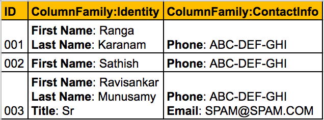
- Data organized into rows and columns (looks similar to a relational db)
	- IMPORTANT FEATURE: Columns are divided into groups called column-family
		- Rows can be sparse (does NOT need to have value for every column)
	- Use cases: IOT streams, real time analytics, financial data - transaction histories, stock prices etc
- Managed Service: Amazon Keyspaces (for Apache Cassandra), Azure Cosmos DB Cassandra API, Google Cloud Bigtable

## Semi Structured Data - An overview

Video - https://www.youtube.com/watch?v=h-qM4J2ueHQ&list=PLBBog2r6uMCQgjZrb1auB1VdMrS-YqYzz&index=10


