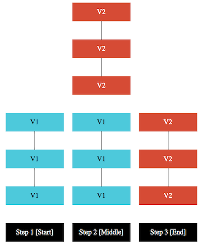
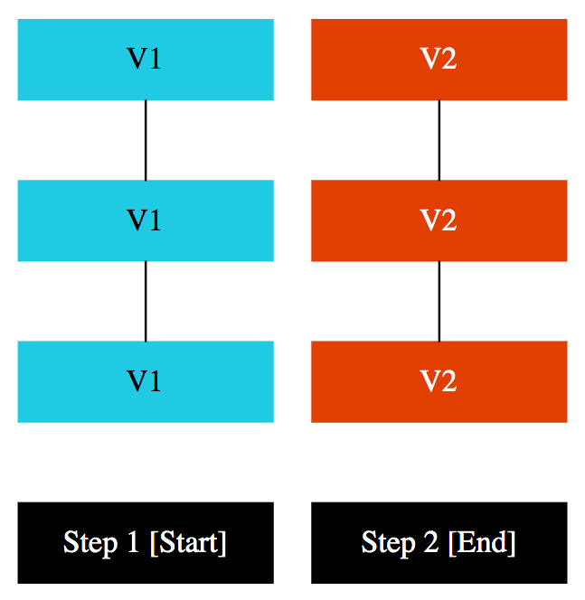
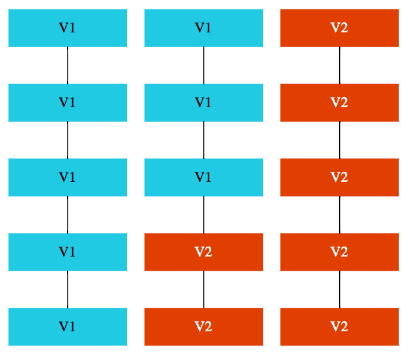
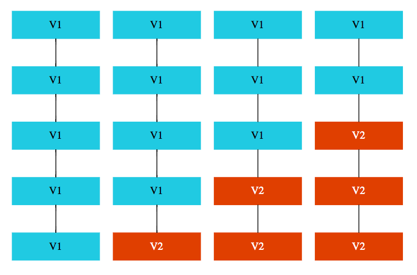
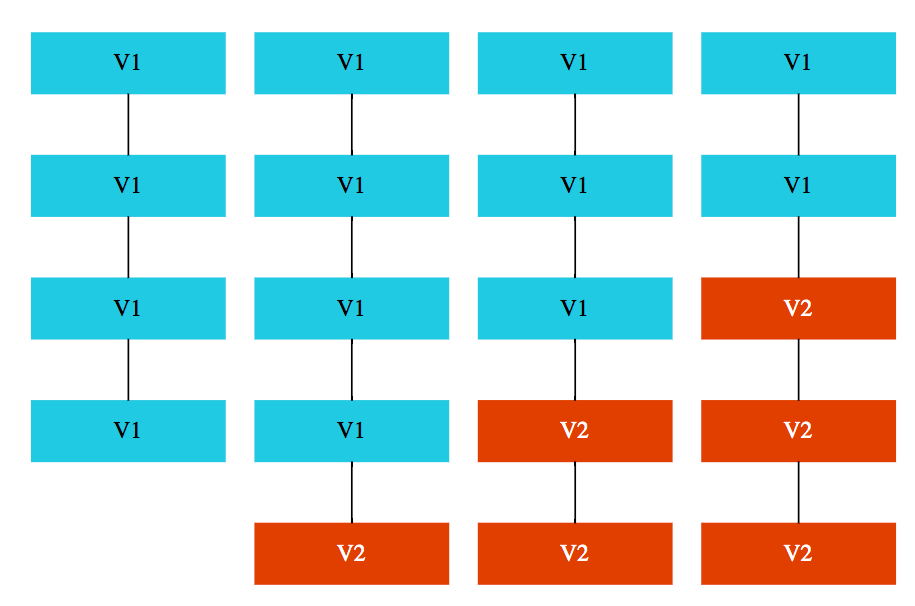
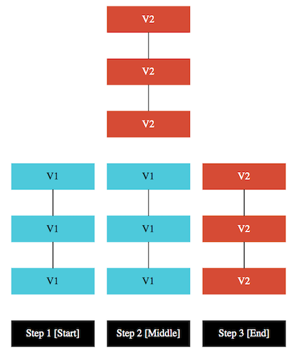

## HTTP vs HTTPS vs TCP vs TLS vs UDP

- Network Layer:
	- IP (Internet Protocol): Transfer bytes. Unreliable.
- Transport Layer:
	- TCP (Transmission Control): Reliability > Performance
	- TLS (Transport Layer Security): Secure TCP
	- UDP (User Datagram Protocol): Performance > Reliability
- Application Layer:
	- HTTP(Hypertext Transfer Protocol): Stateless Request Response Cycle
	- HTTPS: Secure HTTP
	- SMTP: Email Transfer Protocol
	- and a lot of others...
- Most applications typically communicate at application layer
	- Web apps/REST API(HTTP/HTTPS), Email Servers(SMTP), File Transfers(FTP)
	- All these applications use TCP/TLS at network layer(for reliability)
- HOWEVER applications needing high performance directly communicate at transport layer:
	- Gaming applications and live video streaming use UDP (sacrifice reliability for performance)
- Objective: Understand Big Picture. Its OK if you do not understand all details.

# Virtual Machines (Existing Article to be updated)

## What is Virtualization?
One Server => Multiple VMs

## Virtualization in Cloud
- How about offering virtualization as a service on the cloud?
- Cloud providers allow their customers to create virtual machines in the cloud.
- You don't need to buy the entire server
	- Just create a virtual machine
	- Use it 
	- Delete it
	- Pay only for the time you use it
- Isn't it awesome?

## Virtualization Services - Features

- Create and manage lifecycle of Virtual Machine (VM) instances
- Load balancing and auto scaling for multiple VM instances
- Attach storage to your VM instances
- Manage network connectivity and configuration for your VM instances

# Need for Multiple Environments

## Why do we have Dev, QA, Staging and Production Environments

## Configuration Management

- You want to connect to a different database in different environments
	- How do you externalize database configuration from the application?
	- How do you decouple your application from the specific configuration needed in a specific environment?
- Considerations:
	- Is the configuration secure?
		- Are the configuration values encrypted?
		- Can you store passwords?
	- How can application retrieve the configured values?
	- What is involved in changing the configuration values?

---
## Release Management

 
- Goals: vary from app to app
	- Zero Downtime
	- Only one version live at a time
	- Minimize Costs (and infrastructure needed)
	- Test with production traffic before going live
- Best Practices:
	- Small incremental changes
	- Automation (as much as possible)
	- Handling problems with new releases:
		- Analyze logs and metrics from Cloud Monitoring and Logging
		- Rollback to previous release and try replicating the problem in other environments

## Deployment Approach : Recreate
 
- Approach:
	- Terminate Version 1
	- Roll out Version 2
- Characteristics:
	- App down during the release
	- Rollback needs redeployment 
		- AND more downtime
	- Cost effective and Fast 
		- BUT disruptive
	- Avoid need for backward compatibility (data and applications)

## Deployment Approach : Canary
 
- Approach:
	- Step 1: V2 rolled out to a subset of instances
	- Step 2: On successful testing, V2 rolled out to all instances
		- OR V2 is rolled back in case of failure
- Characteristics:
	- Fast
	- Zero downtime
	- No extra infrastructure
	- Minimizes impact to users (in case of release failures)
	- Needs Backward compatibility (data and applications)

## Testing Approach : A/B Testing
 
- Use case: You want to see if users like a feature!
- Approach:
	- Step 1: V2 (with new feature) rolled out to a subset of users
	- Step 2: On successful testing, V2 rolled out to all users
		- OR we go back to V1 in case users don't like the feature!
- Characteristics:
	- Gives the ability to test if your users like a feature

## Deployment Approach : Rolling
 
- Approach:
	- Step 1: V2 rolled out to a percentage of instances (Example window size: 5%)
	- Step 2..N: V2 gradually rolled out to rest of the instances (Example: 5% at a time)
- Characteristics:
	- Slow
	- Zero downtime
	- Needs automation and additional setup
	- No extra infrastructure
	- Minimizes impact to users (in case of release failures)
	- Needs Backward compatibility (data and applications)

## Deployment Approach : Rolling with Additional Batch
 
- Approach:
	- Step 1: Additional batch of new instances are created with V2 (Example: 5%)
	- Step 2..N: V2 gradually rolled out to the instances batch by batch (Example: 5% at a time)
- Characteristics:
	- Same as Rolling Deployment except for:
		- Needs Little bit of extra infrastructure
		- ZERO reduction in number of instances handling user requests

## Deployment Approach : Blue Green
 
- Approach:
	- Step 1: V1 is Live
	- Step 2: Create (or replicate) a parallel environment with V2
	- Step 3: Switch all traffic from V1 to V2 (and remove V1 Environment)
- Characteristics:
	- Instant
	- Zero Downtime
	- Easy Rollback	
	- Needs additional infra (during the release)
	- ZERO reduction in available capacity
	- Needs Backward compatibility (data and apps)

## Testing Approach : Shadow
 
- Approach:
	- Step 1: V1 is Live
	- Step 2: Create (or replicate) a parallel environment with V2
		- Mirror traffic to V1 and V2
	- Step 3: Switch all traffic from V1 to V2 (and remove V1 Environment)
- Characteristics:
	- Zero production impact: Test V2 with real production traffic before releasing
		- You can also capture and replay live production traffic
	- Complicated : You don't want double payments (might need stubbing)
	- Needs a lot of additional infrastructure (during the release)

# Object Storage

Video - https://www.youtube.com/watch?v=n4P62c802vc&list=PLBBog2r6uMCQgjZrb1auB1VdMrS-YqYzz&index=8

https://raw.githubusercontent.com/in28minutes/learning-paths-cloud-and-devops/main/00-cloud-made-easy/8%20-%20Object%20Storage.svg

# Relational Databases

Video - https://www.youtube.com/watch?v=neUX_DJNvSk&list=PLBBog2r6uMCQgjZrb1auB1VdMrS-YqYzz&index=9

https://raw.githubusercontent.com/in28minutes/learning-paths-cloud-and-devops/main/00-cloud-made-easy/9%20-%20Relational%20Databases.svg

# AWS for Beginners

Goal of the article: Quick Visual Introduction to AWS

https://github.com/in28minutes/learning-paths-cloud-and-devops/blob/main/00-cloud-made-easy/AWS-For-Beginners.svg

https://youtu.be/rq8qvAs27rg

# Azure for Beginners

Goal of the article: Quick Visual Introduction to Azure

https://www.youtube.com/watch?v=kg4tV1HOfns

https://raw.githubusercontent.com/in28minutes/learning-paths-cloud-and-devops/683aa9d8f40b9240a283aed19f30f5d7c3e671be/00-cloud-made-easy/Azure-For-Beginners.svg

# Google Cloud for Beginners

Goal of the article: Quick Visual Introduction to Google Cloud

- https://www.youtube.com/watch?v=OwF9-K5JFb8
- I'm unable to find the image

# Why Multi Cloud?

## Enterprises are going multi cloud

Multi-cloud is the future of enterprise IT. 80% of enterprises have a multi-cloud strategy!

## Most Learners are going multi cloud

Career Path 1: AWS (2 Years) > Azure (1 Year) > AWS (1 Year)

Career Path 2: Google Cloud (2 Years) > AWS (1 Year)

Career Path 3: AWS (2 Years) > Google Cloud (2 Years)

## Multi Cloud is Easy!

Fundamentally, all cloud platforms are the same!

Same services with Different Branding!